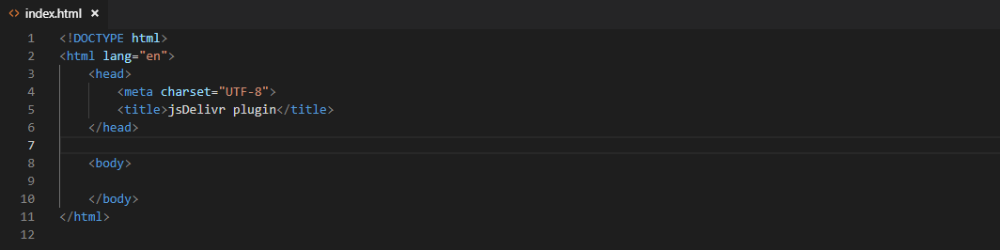

# plugin-visual-studio-code

Quickly insert any npm package from [jsDelivr CDN](https://www.jsdelivr.com).

Launch command "Add jsDelivr package" from command palette.

## Installation

In your IDE, go to `File -> Preferences -> Extensions` and search for `jsDelivr`.

## Features

 - Insert just the URL, HTML code, or HTML + SRI.
 - Offers [minified versions](https://www.jsdelivr.com/features#minify) of all CSS/JS files.

## Setup for development

1. Fork the repository
2. In Visual Studio Code IDE open new terminal and run `npm install`
3. Press F5 to run
